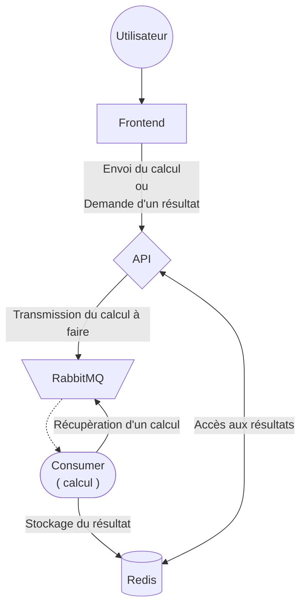

# virt-cc-ilia-mathieu-dunand

Calculatrice Cloud Native

Tom Dunand
Elyes Mathieu

La calculatrice permet la réalisation de calcul au travers d'une interface utilisateur.

Au moyen d'une api, et d'un frontend, quatre opérations de base sont possible (+, -, x, /).

On transmet le calcul à RabbitMQ pour gerer la file d'attente. Le consumer ainsi le récupère et réalise l'opération.

On peut enfin stocker les résultats de calculs dans Redis, qui avec l'aide de l'api permet la récupération des opérations.

Ci-dessous l'architecture de la calculatrice:

