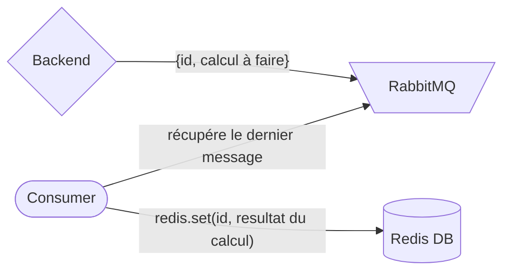
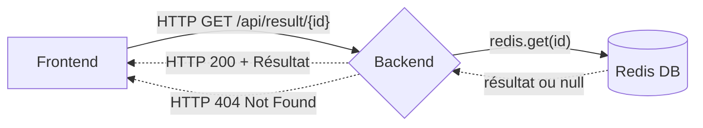

## Redis

Pour stocker les calculs on dispose de l'id et du  resultat du calcul

Voici le schéma pour la réalisation d'un calcul:

```mermaid
graph LR
    B{Backend} -->|"{id, calcul à faire}"| Q[\ RabbitMQ /]
    C([Consumer]) -->|"récupére le dernier message"| Q[\ RabbitMQ /]
    C -->|"redis.set(id, resultat du calcul)"| R[(Redis DB)]

```

Et pour la récupération d'un résultat:

```mermaid
graph LR
    F[Frontend] -->|"HTTP GET /api/result/{id}"| B{Backend}
    B -->|"redis.get(id)"| R[(Redis DB)]
    R -.->|"résultat ou null"| B
    B -.->|HTTP 200 + Résultat| F
    B -.->|HTTP 404 Not Found| F

```