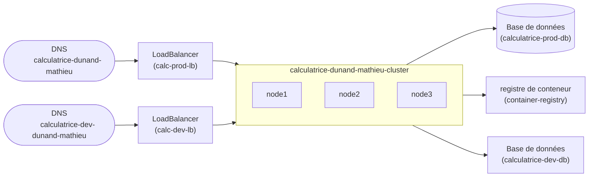

# Architecture




# Résultat de terraform plan:

```console
Terraform used the selected providers to generate the following execution plan. Resource actions are indicated with the following symbols:
  + create

Terraform will perform the following actions:

  # scaleway_domain_record.dns will be created
  + resource "scaleway_domain_record" "dns" {
      + data            = (known after apply)
      + dns_zone        = "polytech-dijon.kiowy.net"
      + fqdn            = (known after apply)
      + id              = (known after apply)
      + keep_empty_zone = false
      + name            = "calculatrice-dev-dunand-mathieu"
      + priority        = (known after apply)
      + project_id      = (known after apply)
      + root_zone       = (known after apply)
      + ttl             = 3600
      + type            = "A"
    }

  # scaleway_k8s_cluster.cluster will be created
  + resource "scaleway_k8s_cluster" "cluster" {
      + apiserver_url               = (known after apply)
      + cni                         = "cilium"
      + created_at                  = (known after apply)
      + delete_additional_resources = false
      + id                          = (known after apply)
      + kubeconfig                  = (sensitive value)
      + name                        = "calculatrice-dunand-mathieu-cluster"
      + organization_id             = (known after apply)
      + project_id                  = (known after apply)
      + region                      = (known after apply)
      + status                      = (known after apply)
      + type                        = (known after apply)
      + updated_at                  = (known after apply)
      + upgrade_available           = (known after apply)
      + version                     = "1.29.1"
      + wildcard_dns                = (known after apply)

      + auto_upgrade (known after apply)

      + autoscaler_config (known after apply)

      + open_id_connect_config (known after apply)
    }

  # scaleway_lb.lb will be created
  + resource "scaleway_lb" "lb" {
      + id                      = (known after apply)
      + ip_address              = (known after apply)
      + ip_id                   = (known after apply)
      + ip_ids                  = [
          + (known after apply),
        ]
      + ipv6_address            = (known after apply)
      + name                    = "calc-dev-lb"
      + organization_id         = (known after apply)
      + project_id              = (known after apply)
      + region                  = (known after apply)
      + ssl_compatibility_level = "ssl_compatibility_level_intermediate"
      + type                    = "LB-S"
      + zone                    = "fr-par-1"
    }

  # scaleway_lb_ip.ip will be created
  + resource "scaleway_lb_ip" "ip" {
      + id              = (known after apply)
      + ip_address      = (known after apply)
      + is_ipv6         = false
      + lb_id           = (known after apply)
      + organization_id = (known after apply)
      + project_id      = (known after apply)
      + region          = (known after apply)
      + reverse         = (known after apply)
      + zone            = "fr-par-1"
    }

  # scaleway_rdb_database.dev[0] will be created
  + resource "scaleway_rdb_database" "dev" {
      + id          = (known after apply)
      + instance_id = (known after apply)
      + managed     = (known after apply)
      + name        = "calculatrice-dev-db"
      + owner       = (known after apply)
      + region      = (known after apply)
      + size        = (known after apply)
    }

  # scaleway_rdb_instance.redis_instance will be created
  + resource "scaleway_rdb_instance" "redis_instance" {
      + backup_same_region        = (known after apply)
      + backup_schedule_frequency = (known after apply)
      + backup_schedule_retention = (known after apply)
      + certificate               = (known after apply)
      + disable_backup            = false
      + endpoint_ip               = (known after apply)
      + endpoint_port             = (known after apply)
      + engine                    = "redis"
      + id                        = (known after apply)
      + is_ha_cluster             = false
      + name                      = "calculatrice-dev-rdb"
      + node_type                 = "DB-DEV-S"
      + organization_id           = (known after apply)
      + password                  = (sensitive value)
      + project_id                = (known after apply)
      + read_replicas             = (known after apply)
      + region                    = "fr-par"
      + settings                  = (known after apply)
      + user_name                 = "admin"
      + volume_size_in_gb         = 10
      + volume_type               = "lssd"

      + load_balancer (known after apply)

      + logs_policy (known after apply)
    }

  # scaleway_registry_namespace.registry will be created
  + resource "scaleway_registry_namespace" "registry" {
      + description     = "Registry calculatrice"
      + endpoint        = (known after apply)
      + id              = (known after apply)
      + name            = "container-registry"
      + organization_id = (known after apply)
      + project_id      = (known after apply)
      + region          = (known after apply)
    }

Plan: 7 to add, 0 to change, 0 to destroy.

Changes to Outputs:
  + lb_ip = (known after apply)

────────────────────────────────────────────────────────────────
```