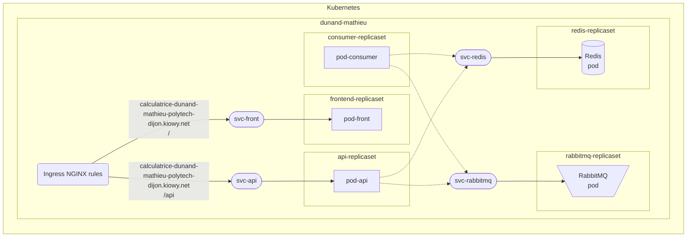

Le nom du namespace est: dunand-mathieu

il faut les replicaset:
- api-replicaset.yaml
- frontend-replicaset.yaml
- consumer-replicaset.yaml
- rabbitmq-replicaset.yaml
- redis-replicaset.yaml

les services:
- api-service.yaml
- frontend-service.yaml
- rabbitmq-service.yaml
- redis-service.yaml

et:
- ingress.yaml

## Schéma Descriptif

